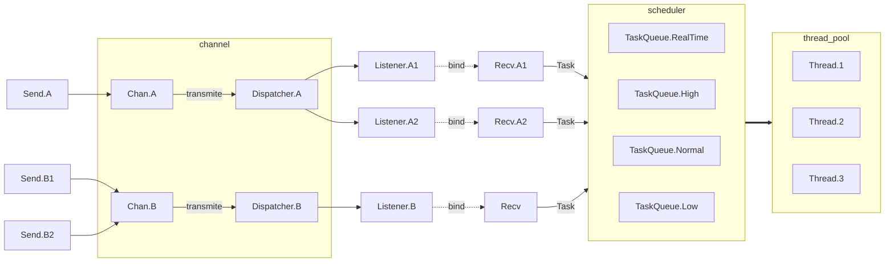

# Cyber

Cyber 通信模型



Cyber 代码示例

```c++
struct Message{};

void on_message(Message msg) {
    //...
}

void test() {
    // recv
    cyber::Recv<Message> recv{"ni.adas.test"};
    recv.bind(on_message);

    // send
    cyber::Send<Message> send{"ni.adas.test"};
    send.send(msg...);
}
```
