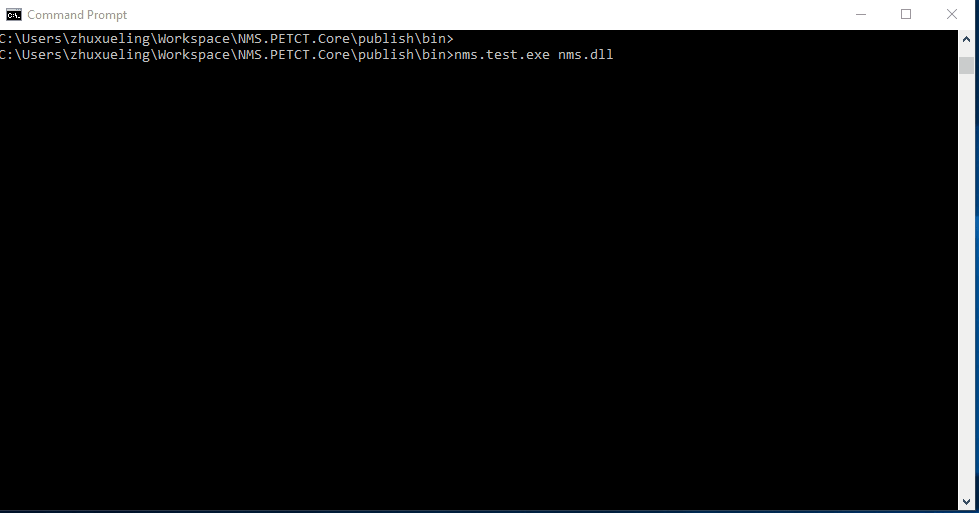

# unit test


特点如下：
1. 不需要单独创建测试文件，测试功能和源代码可以在一个文件中。
2. 不需要单独创建测试工程，测试功能和原工程可以在一个工程中。

nms.test的使用方法如下：
#### 1. 在原代码中添加测试代码段

如果有以下代码:
```cpp
/* --- test.cpp --- */
namespace nms
{
class T
{
public:
   int doSth();
private:
   //...
};
}
```
对此做单元测试，
```cpp
#include <nms/test.h>               //1. 包含单元测试头文件

namespace nms
{
class T
{
public:
   void doSth();
private:
   //...
};
}

nms_test(T_doSth) {                 //2.  创建一个测试,命名为T_doSth
   Foo t;
   const auto ret = t.doSth();      //3.1 调用doSty，如果发生异常，测试失败。
   assert_eq(ret, 0);               //3.2 检测ret是否等于0，如果非0则测试失败。
}

}
```

之后，编译这个项目，会生成动态库或者可执行程序，下面假设生成的动态库为my_lib.dll。
使用nms.test对这个动态库进行单元测试，


```bash
# 全部测试
% nms.test  my_lib.dll

# 请注意到， 我们刚刚创建的测试在nms名字空间下，如果只想开启这个名字空间下的单元测试：
% nms.test my_lib.dll nms::

# 排除nms下面的测试
% nms.test my_lib.dll -nms::
```

